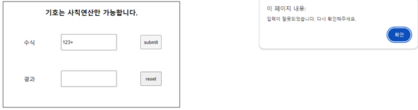
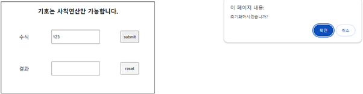
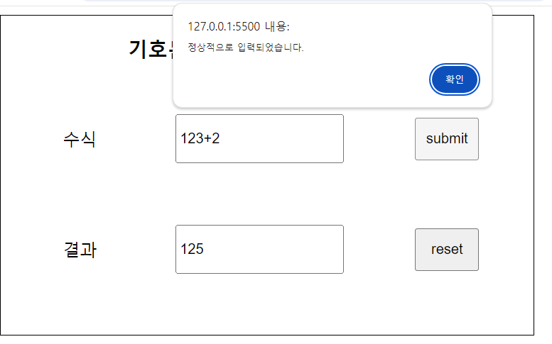
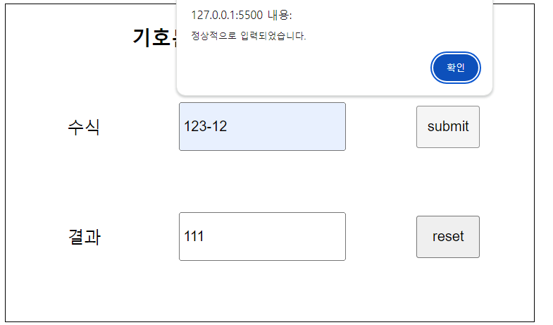
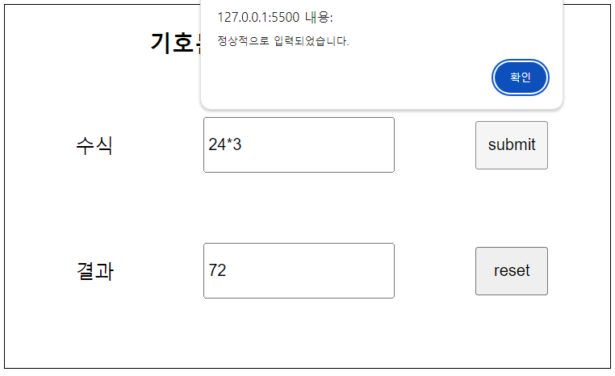
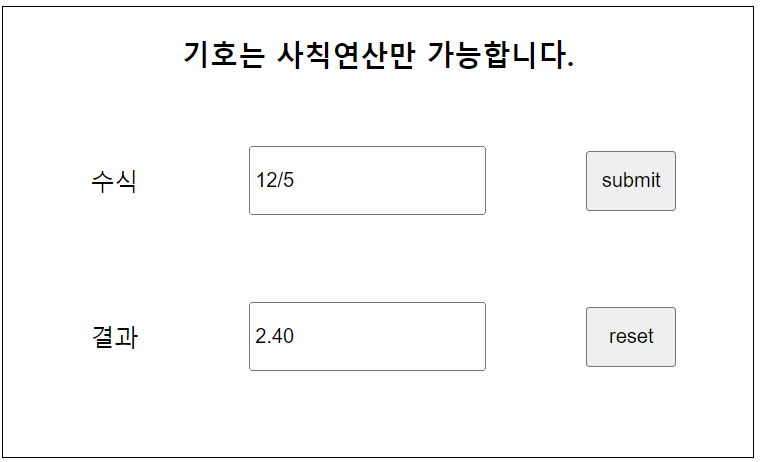

# 협업 규칙

## Commit 메세지

- 제목과 본문을 빈 행으로 구분합니다.
- 제목을 50글자 이내로 제한합니다.
- 제목의 첫 글자는 대문자로 작성합니다.
- 제목의 끝에는 마침표를 넣지 않습니다.
- 제목은 명령문으로! 과거형을 사용하지 않습니다.
- 본문의 각 행은 72글자 내로 제한합니다.
- 어떻게 보다는 무엇과 왜를 설명합니다.

### Ex ) git commit -m “[Feat]: 더하기 기능 추가”

- [Feat] : 기능 추가
- [Fix] : 기능 수정

## branch 전략

- main

  - dev

    - jd
      - feature/html
      - feature/css
      - feature/js/validation
    - wy
      - feature/js/cal
      - feature/readme

## 결과물

## 배운점, 어려웠던 부분

정원영

- 배운점 : merge 과정에서 충돌이 일어났고, 그 과정을 해결하는 부분에서 git 흐름에 대해서 배울 수 있었습니다.
- 어려웠던 부분 : 브랜치 전략에 있어서 브랜치명을 생각하는 부분이 어려웠습니다.

김재동

- 배운점 : checkout과 같은 git 명령어를 활용하는 역량을 키울 수 있었습니다.
- 어려웠던 부분 : 보고 따라치기만 할 때와는 달리, 실습을 직접 진행하다보니 생각보다 오류가 자주 발생해서 어려웠습니다.
